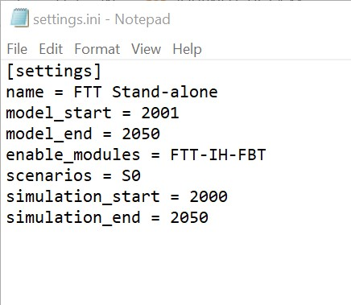
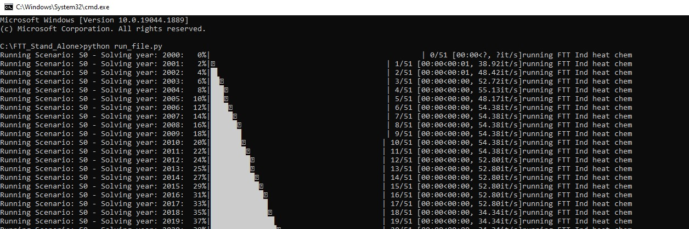
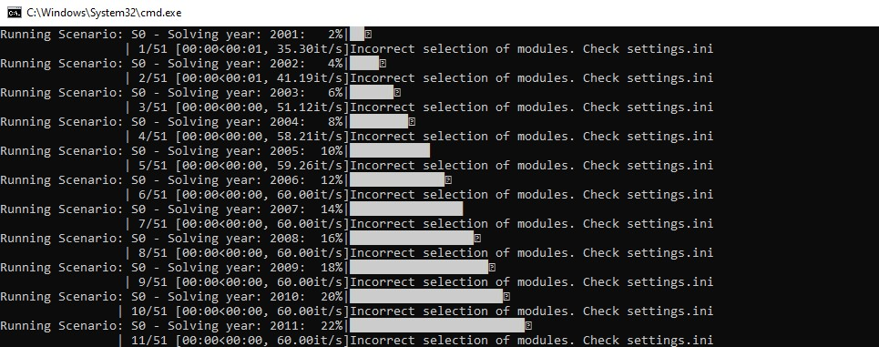
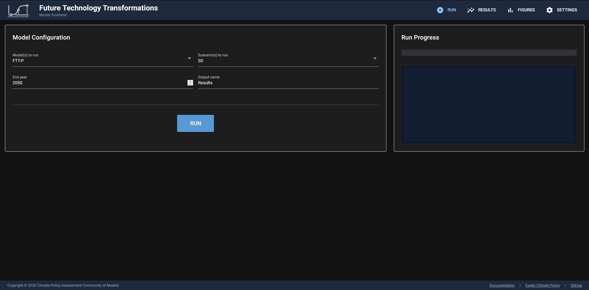
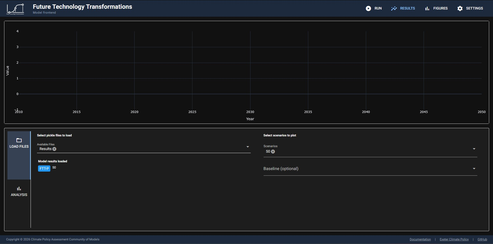
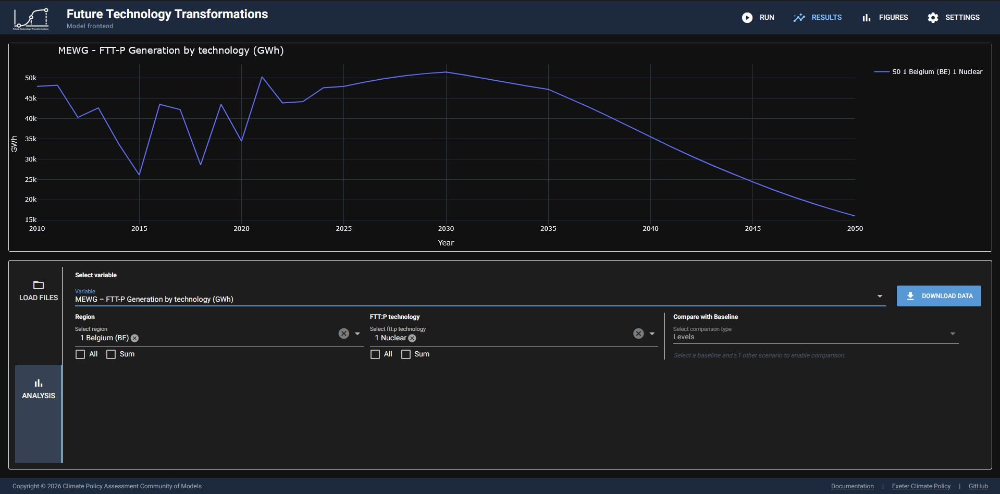

Running FTT
==========================

Running FTT from the command line
#############################################

**FTT** can be run from the command line or terminal by calling the run file, run_file.py,
which is located in the main project folder **FTT_Stand_Alone**. In order for the model to run correctly, 
the correct initialisation settings must be input into settings.ini, which is also in the main project 
folder:

The different modules in FTT can be enabled in settings.ini, and it is possible to enable 
multiple different modules at the same time by using commas to separate, e.g. 
  
  enable_modules = FTT-P, FTT-Fr

S0 is FTT's baseline scenario, which incorporates current policies and projections 
into the model's simulation. Scenarios which differ from the baseline due to changes in policy inputs 
can be run alongside the baseline. Two additional scenarios for FTT: Power already exist, S1 and S2.

It is recommended that **model_start** and **simulation_start** are left unchanged, as the model will be 
unable to run if there is a gap between the start year of the simulation and the last year of historical data. 
However, **model_end** and **simulation_end** can be changed to any date after the start date. This allows the
model to be run for shorter periods of time when necessary. 2050 is currently the maximum end year of the 
simulation period.

The model will tell you which module is running. If an incorrect selection of modules is made, this will be printed 
in the command window.

Running the model this way will allow it to easily be tested, with errors or warnings appearing in the command window. 
However, the results of the model cannot be viewed when running this way.

Running FTT from the front end
##########################################

The model's front end environment can be launched by clicking on launch_frontend.cmd, or running
run_frontend.py from the command line. The front end will allow you to visualise the results of
the simulation. 

To run the model, go to the **RUN** page and select the desired settings:

To run a standard baseline scenario for any module, select scenario S0 and the 
end year to 2050. Click **RUN**. The status of the run will display in the panel on the right. Click the
**RESULTS** page to view the model results. This page is split in two, with the upper part showing the 
results plot and the lower part containing filters for the data:

To view results, first select which results file to read from the **Available files** select box.
Each run of FTT will create a new pickle file which can contain results for multiple scenarios and models. If your results
file contains multiple scenarios, you can select which scenario(s) you wish to view on the right hand side, along with which
scenario is your baseline. Next, navigate to the **ANALYSIS** tab within the **RESULTS** page:

 
Select which variable to display in the plot using the **Select variable** select box. Variables can be searched for by using
either their code or their description. Next, pick the values of the variable's dimensions. This is frequently **Region** and **Technology**.
If you have selected more than one scenario and a specified a baseline, you can also view the absolute or relative difference of the variable
from the baseline by using the **Compare with baseline** select box. The **DOWNLOAD DATA** button will export the data currently displayed
in the plot to a CSV file.

The start and end year of the plot as well as whether dark mode is enabled can be changed in the **SETTINGS** page. 
